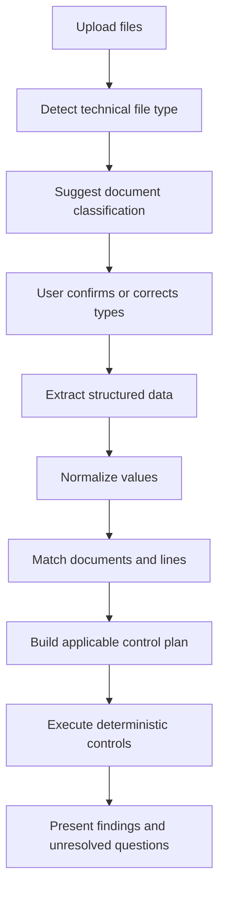

# Intelligent Dossier Analysis Engine

**Project:** BARD  
**Status:** Functional architecture v1  
**Scope:** First implementation for excise refund dossiers  

## 1. Purpose

This document defines how BARD analyses a dossier containing a variable set of documents.

BARD must not rely on one fixed dossier composition. A dossier may contain purchase invoices, sales invoices, AC4 declarations, eAD/eVAD documents, a refund claim and other supporting evidence, but not every dossier contains every document type.

The engine must therefore:

1. identify the uploaded document types;
2. allow the user to correct every classification;
3. extract structured facts from each document;
4. determine which documents or document lines belong together;
5. build only the comparisons that are relevant for the available evidence;
6. report matches, differences, missing evidence and unresolved questions;
7. leave the final assessment to the user.

The first version is deliberately pragmatic. It does not require a graph database, microservices, a generic rules product or a self-learning legal decision system.

---

## 2. Core principles

### 2.1 File type is not document type

A PDF, Excel workbook, image or XML file is only a technical file format.

Examples of functional document types are:

- refund claim;
- purchase invoice;
- sales invoice;
- credit note;
- AC4;
- eAD;
- eVAD;
- EXA;
- CMR;
- payment proof;
- correspondence;
- other or unknown.

An Excel workbook must never automatically be treated as a refund claim merely because it is an Excel file.

### 2.2 BARD proposes; the user decides

BARD may suggest a document type and show a confidence score, but every suggestion remains editable.

Example:

```text
SAD_AC4_LIST.pdf
Suggested type: AC4
Confidence: 96%
Document type: [ AC4 ▼ ]
```

The user-selected type is authoritative for the remainder of the analysis. The original suggestion remains stored for audit and troubleshooting.

### 2.3 No fixed dossier checklist

BARD must not assume that every valid dossier contains exactly the same documents.

Examples:

- If purchase invoices are present, sales may be compared with purchases.
- If no purchase invoice is present but a foreign eAD/eVAD documents the incoming goods, that movement may serve as the available source for the incoming quantity.
- If neither a purchase invoice nor suitable movement evidence exists, BARD reports that the incoming goods are insufficiently documented.

Absence of one particular document is therefore not automatically an error. The relevant question is whether the required fact can be established from another source.

### 2.4 Comparisons are conditional

BARD only performs a comparison when the required source data exists.

Example:

```text
Sales invoice ↔ purchase invoice
Status: Not applicable
Reason: No purchase invoice classified in this dossier.
```

This is not a failed check.

### 2.5 Deterministic calculations remain deterministic

AI may assist with recognition, extraction, normalization and suggested matching. It must not invent quantities, silently correct source values or decide legal calculations by intuition.

Exact calculations, tolerances and business rules must be implemented as deterministic code.

### 2.6 Every result must be explainable

Each result must show:

- what was compared;
- which source documents and lines were used;
- the values found;
- the rule or tolerance applied;
- why the result passed, warned, failed or was skipped.

---

## 3. Analysis lifecycle



### 3.1 Upload

Immediately after upload, BARD only reports technical information.

```text
3 files uploaded

TERUGGAVEDOSSIER.xlsx
Excel workbook — awaiting analysis

invoice-145.pdf
PDF — awaiting analysis

AC4-991.pdf
PDF — awaiting analysis
```

### 3.2 Classification

BARD analyses the contents and suggests a functional type.

```text
TERUGGAVEDOSSIER.xlsx
Suggested: Refund claim
Confidence: 94%
[ Refund claim ▼ ]
```

The user must be able to change the type before or after extraction.

### 3.3 Extraction

For every confirmed document type, BARD extracts the fields defined for that type.

### 3.4 Matching

BARD proposes which document lines describe the same goods, transaction or movement.

### 3.5 Control plan

Based on the available document types and extracted fields, BARD composes the applicable comparisons.

### 3.6 Validation

BARD executes those comparisons and produces clear findings.

---

## 4. Initial document catalogue

The catalogue must remain extensible, but the first implementation should focus on the document types needed for refund dossiers.

| Code | Document type | Initial priority |
|---|---|---:|
| `REFUND_CLAIM` | Refund claim workbook or form | High |
| `SALES_INVOICE` | Sales invoice | High |
| `PURCHASE_INVOICE` | Purchase invoice | High |
| `CREDIT_NOTE` | Credit note | Medium |
| `AC4` | AC4 declaration | High |
| `EAD` | eAD | High |
| `EVAD` | eVAD | High |
| `EXA` | Export declaration | Medium |
| `CMR` | Transport document | Low |
| `PAYMENT_PROOF` | Payment proof | Low |
| `CORRESPONDENCE` | Email, letter or explanatory note | Low |
| `OTHER` | Known but unsupported document | Always available |
| `UNKNOWN` | Not classified | Always available |

The dropdown must always include `OTHER` and `UNKNOWN`. BARD must be allowed to admit uncertainty.

---

## 5. Document record

Each uploaded file is stored as a document record.

```text
Document
- id
- dossierId
- originalFileName
- mediaType
- fileHash
- uploadedAt
- uploadedBy
- aiSuggestedType
- aiClassificationConfidence
- confirmedType
- confirmedBy
- confirmedAt
- processingStatus
- extractionVersion
- rawTextReference
```

### 5.1 Processing statuses

Recommended statuses:

- `Uploaded`
- `Classifying`
- `NeedsClassification`
- `Classified`
- `Extracting`
- `NeedsReview`
- `Ready`
- `Failed`

### 5.2 Classification source

The current type should also record its source:

- `AI`
- `User`
- `Rule`

A user correction always takes precedence over an AI suggestion.

---

## 6. Extraction model

BARD should not force every document into one giant universal table. Each document type gets a focused extractor, while all extracted values share a small common structure.

```text
ExtractedField
- documentId
- fieldName
- rawValue
- normalizedValue
- dataType
- confidence
- sourceLocation
- validationStatus
- correctedByUser
```

`sourceLocation` may identify:

- PDF page and bounding area;
- Excel worksheet and cell;
- XML path;
- image page or region.

The raw value must always be preserved.

### 6.1 Common normalized data types

- text;
- date;
- decimal number;
- currency amount;
- percentage;
- quantity;
- volume;
- weight;
- identifier;
- company;
- country;
- excise code;
- MRN;
- VAT number;
- excise number.

### 6.2 Document-specific extraction

#### Refund claim

Initial fields:

- claim reference;
- claimant;
- claim period;
- claim lines;
- product description;
- excise code;
- quantity;
- unit;
- alcohol percentage where applicable;
- claimed excise amount;
- claimed additional excise amount;
- claimed packaging levy where applicable;
- source references such as invoice or AC4 numbers when present.

#### Sales invoice

Initial fields:

- invoice number;
- invoice date;
- seller;
- customer;
- VAT numbers;
- delivery address;
- currency;
- line number;
- product description;
- quantity;
- unit;
- package size;
- alcohol percentage;
- line amount;
- references to AC4, eAD/eVAD, order or transport documents.

#### Purchase invoice

Initial fields are similar to sales invoices, with the parties interpreted from the claimant's perspective.

#### AC4

Initial fields:

- document reference;
- declaration date;
- declarant;
- consignor;
- consignee;
- destination country;
- product lines;
- excise code;
- quantity;
- unit;
- alcohol percentage;
- duty amount where present;
- references to invoices or movements.

#### eAD/eVAD

Initial fields:

- ARC or movement reference;
- movement type;
- dispatch date;
- arrival or validation date;
- consignor;
- consignee;
- origin and destination;
- product lines;
- excise product code;
- quantity;
- unit;
- alcohol percentage;
- invoice references where present.

### 6.3 Line-level extraction is mandatory

Totals alone are insufficient. BARD must extract line items because one document may contain several products, excise codes or shipments that link to different documents.

---

## 7. Normalization

Values must be normalized before comparison while keeping the original representation.

Examples:

```text
Raw: 0,70 L
Normalized: 0.700 litre
```

```text
Raw: 240 bottles × 70 cl
Normalized: 168.000 litres
```

```text
Raw: 14/03/2026
Normalized: 2026-03-14
```

### 7.1 Product descriptions

Product descriptions should be normalized conservatively.

```text
Southern Comfort 70 cl 35%
Southern Comfort 0,7 L
SOUTHERN COMFORT 700ML
```

BARD may suggest that these refer to the same product, but it must retain distinguishing properties such as alcohol percentage, package size and excise code.

### 7.2 Units

The system must support explicit conversion rules, including at least:

- bottles to litres when package size is known;
- centilitres and millilitres to litres;
- litres to hectolitres;
- kilograms and grams;
- package count versus physical volume.

A conversion may only occur when the required factors are available. BARD must not guess a bottle size.

### 7.3 Company names

Names may be normalized for matching while preserving the source spelling.

```text
ABC Drinks BV
ABC DRINKS B.V.
ABC Drinks
```

Company matching should also use VAT or excise numbers where available.

---

## 8. Linking model

### 8.1 Purpose

Linking determines which document lines most likely describe the same goods or transaction.

The first implementation should use a transparent weighted score, not an opaque autonomous reasoning system.

### 8.2 Matching signals

Possible signals include:

| Signal | Typical importance |
|---|---:|
| Exact reference number | Very high |
| MRN, ARC or AC4 reference | Very high |
| Excise code | High |
| Product identity | High |
| Normalized quantity | High |
| Customer or consignee | High |
| Supplier or consignor | Medium |
| Alcohol percentage | Medium to high |
| Package size | Medium |
| Date proximity | Medium |
| Country or destination | Medium |

Weights must be configurable in normal application settings or code constants. A generic rules platform is not required.

### 8.3 Match states

- `Confirmed`: user-confirmed link;
- `Suggested`: strong automatic candidate;
- `Ambiguous`: several plausible candidates;
- `Rejected`: user or rule rejected the link;
- `Unmatched`: no suitable candidate.

### 8.4 Cardinality

The model must support:

- one invoice line to one AC4 line;
- one invoice line to several AC4 lines;
- several invoice lines to one AC4 line;
- several purchase lines to several sales or movement lines.

Split and aggregated shipments are normal scenarios.

### 8.5 Example

```text
Sales invoice INV-145, line 3
240 bottles Southern Comfort 70 cl

Suggested links:
1. AC4-991, line 1 — 97%
2. AC4-992, line 2 — 64%

Reason for candidate 1:
- same customer;
- same product;
- same excise code;
- same normalized quantity;
- AC4 date is one day after invoice date.
```

The user must be able to confirm, reject or change the proposed link.

---

## 9. Evidence roles

A document type and an evidence role are related but not identical.

A document may support one or more roles:

- incoming goods or acquisition;
- outgoing sale or delivery;
- movement or transport;
- export or destination;
- excise declaration;
- payment;
- refund calculation;
- explanatory support.

Examples:

- A purchase invoice usually supports incoming goods.
- A foreign eAD/eVAD may support both incoming goods and movement.
- A sales invoice supports sale and customer identity.
- An AC4 supports excise declaration and may also support outgoing quantity.

The initial version may derive default evidence roles from the confirmed document type. The user does not need a complex evidence-role editor unless the automatic role is insufficient for a real dossier.

---

## 10. Dynamic control plan

### 10.1 Purpose

After classification and extraction, BARD builds a list of applicable controls.

The control plan depends on the actual dossier composition.

### 10.2 Example: dossier with purchase invoices

Available:

- refund claim;
- purchase invoices;
- sales invoices;
- AC4 documents.

Applicable controls:

1. refund claim ↔ sales invoices;
2. sales invoices ↔ AC4;
3. purchase quantities ↔ outgoing quantities;
4. product and excise-code consistency;
5. dates and references;
6. claimed totals and statutory calculations.

### 10.3 Example: dossier without purchase invoices

Available:

- refund claim;
- foreign eAD;
- sales invoices;
- AC4 documents.

Applicable controls:

1. refund claim ↔ sales invoices;
2. sales invoices ↔ AC4;
3. incoming eAD quantities ↔ outgoing quantities;
4. eAD products ↔ sales and AC4 products;
5. dates and movement references;
6. claimed totals and statutory calculations.

The purchase-invoice comparison is marked `Not applicable`, not `Failed`.

### 10.4 Example: insufficient incoming evidence

Available:

- refund claim;
- sales invoices;
- AC4 documents.

Result:

```text
Incoming goods or acquisition
Status: Insufficient evidence
Reason: No purchase invoice, eAD, eVAD or other accepted incoming source was identified.
```

Other comparisons still execute.

---

## 11. Initial control catalogue

The first implementation should remain focused. The following controls are sufficient as a first real milestone.

### 11.1 Classification controls

#### `DOC-001` Unconfirmed classification

Warn when a document remains unknown or requires user confirmation.

#### `DOC-002` Duplicate file

Detect exact duplicate uploads using the file hash.

#### `DOC-003` Possible duplicate document

Detect different files that appear to contain the same invoice, AC4 or movement reference.

### 11.2 Incoming evidence controls

#### `IN-001` Incoming source available

Pass when at least one accepted source exists for incoming goods.

Accepted initial sources:

- purchase invoice;
- eAD;
- eVAD.

#### `IN-002` Incoming quantity versus outgoing quantity

Compare the aggregated incoming quantities with linked outgoing quantities per normalized product and excise code.

The control must account for partial quantities and remaining stock when the dossier data supports that distinction. If stock information is unavailable, report the numerical difference without assuming an error.

### 11.3 Sales controls

#### `SALE-001` Sales invoice line matched

Report unmatched sales invoice lines.

#### `SALE-002` Sales quantity versus AC4 quantity

Compare linked sales and AC4 lines after unit normalization.

#### `SALE-003` Customer versus consignee

Compare the sales customer with the AC4 or movement consignee, using identifiers when available.

A difference is a warning requiring explanation, not automatically a failure.

### 11.4 Product controls

#### `PRD-001` Excise-code consistency

Compare the excise code across claim, invoice, AC4 and eAD/eVAD where available.

#### `PRD-002` Alcohol-percentage consistency

Compare alcohol percentage where the code or calculation requires it.

#### `PRD-003` Package-size and unit consistency

Detect incompatible conversions or missing package size.

### 11.5 Claim controls

#### `CLM-001` Claim line matched

Every claim line should have one or more supporting outgoing lines.

#### `CLM-002` Claimed quantity

Compare claim quantity with the sum of linked supporting lines.

#### `CLM-003` Claimed tax components

Recalculate the required tax components deterministically and compare them with the claim.

#### `CLM-004` Unsupported claimed line

Flag claim lines without sufficient supporting evidence.

### 11.6 Chronology controls

#### `DATE-001` Logical date order

Check the expected sequence where dates exist:

```text
incoming event → sale or dispatch → AC4 or movement → claim
```

The exact order may vary by procedure. The rule must explain which dates were compared.

#### `DATE-002` Claim period

Check whether supporting transactions fall within the applicable claim period.

### 11.7 Reference controls

#### `REF-001` Referenced document exists

When a claim, invoice or declaration explicitly references another document, verify that the referenced document exists in the dossier.

#### `REF-002` Reference uniqueness

Warn about unexpected reuse of invoice, AC4, ARC or MRN references.

---

## 12. Control outcomes

Every control returns one of these states:

- `Pass`;
- `Info`;
- `Warning`;
- `Fail`;
- `NotApplicable`;
- `UnableToEvaluate`.

`UnableToEvaluate` is used when the required documents exist but essential values could not be extracted or confirmed.

Example:

```text
Control: Sales quantity versus AC4 quantity
Status: Unable to evaluate
Reason: The quantity on AC4-991 could not be read reliably.
Required action: Confirm the quantity manually.
```

---

## 13. Finding structure

Every finding should use the same response model.

```text
Finding
- controlCode
- title
- outcome
- severity
- summary
- explanation
- expectedValue
- actualValue
- difference
- sourceDocumentIds
- sourceLineIds
- suggestedAction
- requiresUserDecision
```

Example:

```text
SALE-002 — Sales quantity versus AC4 quantity
Outcome: Warning

Invoice INV-145 line 3 contains 240 bottles.
AC4-991 line 1 contains 260 bottles.
Normalized difference: 20 bottles / 14 litres.

Suggested action:
Check whether another invoice line is linked to AC4-991 or whether the AC4 quantity is incorrect.
```

BARD may suggest possible explanations, but these must be labelled as suggestions rather than conclusions.

---

## 14. User interaction

### 14.1 Document review screen

Each uploaded document should display:

- filename;
- technical file type;
- suggested document type;
- confidence;
- editable document-type dropdown;
- processing status;
- extracted key references;
- warning when manual review is required.

### 14.2 Matching review screen

For each relevant document line:

- show the source line;
- show proposed links;
- show match score and reasons;
- allow confirm, reject and manual link;
- show unmatched lines.

### 14.3 Analysis screen

Group findings by practical subject rather than technical module:

- uploaded documents;
- incoming goods;
- sales and delivery;
- AC4 and movements;
- refund claim;
- calculations;
- unresolved issues.

### 14.4 Corrections

The user may correct:

- document type;
- extracted field;
- normalized value;
- document link;
- accepted or rejected finding.

All corrections must be logged with old value, new value, user and timestamp.

---

## 15. AI boundaries

### 15.1 AI may

- suggest document types;
- extract text and fields;
- normalize names and product descriptions;
- propose line links;
- summarize differences;
- suggest likely explanations;
- draft a readable dossier summary.

### 15.2 AI may not

- invent missing values;
- silently replace source values;
- decide that a legal requirement does not apply without a deterministic rule;
- calculate duties or refund amounts by free-form reasoning;
- automatically approve a dossier;
- hide contradictory evidence;
- override user-confirmed classifications or links.

### 15.3 Confidence

Confidence is useful for routing review, not for determining legal correctness.

Suggested thresholds for the user interface:

- `≥ 90%`: strong suggestion;
- `70–89%`: review recommended;
- `< 70%`: manual confirmation required.

These thresholds may be adjusted after testing with real dossiers.

---

## 16. Minimal technical shape

BARD should remain a modular monolith for the foreseeable future.

```text
Frontend
  Upload and document review
  Matching review
  Analysis and findings

API / Application
  Classification
  Extraction
  Normalization
  Matching
  Control-plan builder
  Validation
  Reporting

Infrastructure
  File storage
  Database
  AI/OCR provider adapters
```

No separate microservices or graph database are required for v1.

### 16.1 Suggested backend modules

```text
BARD.Application
  Documents
  Classification
  Extraction
  Matching
  Analysis
  Reporting

BARD.Domain
  Dossiers
  Documents
  ExtractedData
  Links
  Controls
  Findings
```

These are logical folders or namespaces, not independently deployed services.

### 16.2 Suggested main entities

A practical relational model is sufficient:

- `Dossiers`;
- `Documents`;
- `DocumentClassifications`;
- `ExtractedFields`;
- `DocumentLines`;
- `NormalizedProducts`;
- `DocumentLineLinks`;
- `AnalysisRuns`;
- `ControlResults`;
- `UserCorrections`.

A full generic knowledge-graph persistence layer is not required for the first implementation. Relationships can be represented through document lines and explicit link records.

---

## 17. Analysis run and reproducibility

Each analysis execution must create an `AnalysisRun` containing:

- dossier ID;
- start and completion timestamps;
- classification version;
- extraction version;
- matching version;
- control-library version;
- AI model information where available;
- status;
- generated findings.

Re-running an analysis must not silently destroy the previous result. The latest run may be the active result while earlier runs remain available for audit and debugging.

---

## 18. Error handling

A failure on one document must not cancel the entire dossier.

Example:

```text
12 documents processed
11 ready
1 requires manual review
```

Technical failures and dossier findings must remain separate.

Technical example:

```text
OCR provider unavailable for invoice-145.pdf.
```

Business example:

```text
Invoice INV-145 quantity differs from AC4-991.
```

---

## 19. Implementation sequence

The architecture must be implemented incrementally.

### Milestone 1 — Honest upload and classification

- Keep the unified upload zone.
- Display technical file types only before analysis.
- Add document-type suggestions.
- Add an editable dropdown per document.
- Support `Unknown` and `Other`.
- Persist both AI suggestion and user-confirmed type.

### Milestone 2 — Focused extraction

Implement extraction for:

1. refund claim;
2. sales invoice;
3. purchase invoice;
4. AC4;
5. eAD/eVAD.

Store line-level data and source locations.

### Milestone 3 — Normalization and linking

- normalize quantities and units;
- normalize product descriptions;
- propose invoice ↔ AC4 links;
- propose incoming source ↔ sales links;
- provide manual link correction.

### Milestone 4 — First dynamic controls

Implement:

- claim quantity ↔ sales quantities;
- sales quantities ↔ AC4 quantities;
- incoming quantities ↔ outgoing quantities;
- excise-code consistency;
- alcohol-percentage consistency;
- basic date and reference checks.

### Milestone 5 — Analysis report

- group findings by dossier subject;
- explain every result;
- show source documents and lines;
- show unresolved items;
- allow user decisions and comments.

No wider plugin architecture, graph database, automatic learning system or generic enterprise rule engine should be built before these milestones prove a concrete need.

---

## 20. Immediate change to the current upload page

The current upload page must stop presenting every Excel file as a detected claim.

Before analysis:

```text
1 Excel workbook uploaded
2 PDF documents uploaded
```

Per file:

```text
TERUGGAVEDOSSIER.xlsx
Excel workbook — awaiting classification
```

After classification:

```text
TERUGGAVEDOSSIER.xlsx
Suggested type: Refund claim
Confidence: 94%
[ Refund claim ▼ ]
```

A sales spreadsheet, purchase list or unrelated Excel file must be able to remain `Other` or `Unknown`.

This is the next concrete implementation task.

---

## 21. Definition of success

The first useful version succeeds when a user can upload a mixed dossier and BARD can:

1. suggest the type of every document;
2. accept user corrections;
3. extract line-level facts from the five primary document types;
4. suggest sensible links between those lines;
5. skip comparisons that are not applicable;
6. perform the core quantity, code, date and claim calculations;
7. explain every discrepancy with direct references to the source documents;
8. clearly distinguish confirmed facts, suggestions and unresolved questions.

BARD does not need to understand every possible dossier on day one. It must handle the supported dossier patterns correctly, transparently and without pretending certainty where none exists.
